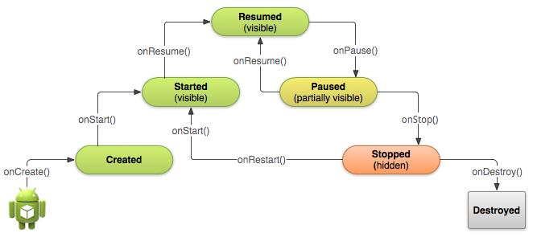

# Estructura proyecto Android

```
Project
    |_ Manifest
        |_ AndroidManifest.xml
    |_ Java
        |_ com.domain.application (Code, activities, models, etc..)
        |_ com.domain.application (Android Test)
        |_ com.domain.application (Test)
    |_ Res
        |_ drawable (Images and designs xml)
        |_ layouts (Activity designs xml)
        |_ minmap (Images)
        |_ values
            |_ strings.xml
            |_ colors.xml
            |_ styles.xml
    |_ Gradle Scripts
        |_ build.gradle (Module app. install dependencies)
```


# Estructura basica de un Activity

Clase fundamental que ayuda a la interacción con el usuario.

```java
public class MainActivity extends AppCompatActivity {

    //Estado onCreate() cuando se costruye la actividad
    @Override
    protected void onCreate(Bundle savedInstanceState) {
        super.onCreate(savedInstanceState);
        //Asigna el contenido de un layout
        setContentView(R.layout.activity_main);

        //R hace referencia a los resources
    }
}
```

# Context, Ciclos de vida de un Activity

**Context:** Contexto o ambiente de la actividad.

## Ciclos de vida

* **onCreate():** Cuando fué creada y hay que inicializar componentes escensiales
* **onStart():** Cuando inicia después de onCreate()
* **onResume():** Cuando reanuda la interacción después de onPause()
* **onPause():** Cuando el sistema pierde focos o enter entra en este estado
* **onStop():** En segundo plano
* **onRestart():** Cuando sale de segundo plano
* **onDestroy():** Cuando se cierra la aplicación



```java
    @Override
    protected void onCreate(Bundle savedInstanceState) {
        super.onCreate(savedInstanceState);
        setContentView(R.layout.activity_main);
        Toast.makeText(this,"onCreate()",Toast.LENGTH_LONG).show();
    }

    @Override
    protected void onStart()
    {
        super.onStart();
        Toast.makeText(this,"onStart()",Toast.LENGTH_LONG).show();
    }

    @Override
    protected void onResume()
    {
        super.onResume();
        Toast.makeText(this,"onResume()",Toast.LENGTH_LONG).show();
    }

    @Override
    protected void onPause()
    {
        super.onPause();
        Toast.makeText(this,"onPause()",Toast.LENGTH_LONG).show();
    }

    @Override
    protected void onRestart()
    {
        super.onRestart();
        Toast.makeText(this,"onRestart()",Toast.LENGTH_LONG).show();
    }

    @Override
    protected void onStop()
    {
        super.onStop();
        Toast.makeText(this,"onStop()",Toast.LENGTH_LONG).show();
    }

    @Override
    protected void onDestroy()
    {
        super.onDestroy();
        android.os.Debug.stopMethodTracing();
    }
```

# Add a third-party library with Gradle

Si queremos agregar algunda libreria de terceros, deberiamos editar el archivo build.gradle

```
Project
    ...
    |_ Gradle Scripts
        |_ build.gradle (Module app. install dependencies)
```

**Por ejemplo**: Para agregar [SuperToast](https://github.com/JohnPersano/SuperToasts) lo hariamos en la seccion **dependencies** como un **implementation**:

```
dependencies {
    implementation fileTree(dir: 'libs', include: ['*.jar'])
    implementation 'com.android.support:appcompat-v7:28.0.0'
    implementation 'com.android.support.constraint:constraint-layout:1.1.3'
    testImplementation 'junit:junit:4.12'
    androidTestImplementation 'com.android.support.test:runner:1.0.2'
    androidTestImplementation 'com.android.support.test.espresso:espresso-core:3.0.2'


    implementation 'com.github.johnpersano:supertoasts:2.0'
}
```

Por ultimo tendriamos que sincronizar nuevamente Gradle.

### Resources

[Material Palette](https://www.materialpalette.com/)

[Flat icons](https://www.flaticon.com)

### *KEYPOINTS*:

* **Gradle:** Herramienta de automatización de builds

# Elementos en la UI

## Layouts 

* ConstraintLayout
* GuideLine (Horizontal o Vertical)
* LinearLayout (Horizontal o Vertical)
* FrameLayout
* TableLayout
* TableRow
* Space

## Layout properties width and height values

**match_parent**: toma todo el ancho o alto dipuesto por el padre.

**wrap_content**: Adapta el tamaño al contenido.

## Unidades de medida en android

* px es un pixel.
* dip o dp son píxeles de densidad independiente (density-independent pixels).
* sp son pixels de escala independiente (scaleable pixels).

# Implementar un evento

Por ejemplo para el clic de un boton. Una de las formas más limpias sería implementar **View.OnClickListener** y asignarlo en el evento **setOnClickListener**.

```java
public class MainActivity extends AppCompatActivity implements View.OnClickListener {

    private Button loginButton;

    @Override
    protected void onCreate(Bundle savedInstanceState) {
        super.onCreate(savedInstanceState);
        setContentView(R.layout.activity_main);

        initializeComponents();
    }

    private void initializeComponents()
    {
        loginButton = findViewById(R.id.LoginButton);
        loginButton.setOnClickListener(this);
    }

    @Override
    public void onClick(View view) {
        Toast.makeText(this,R.string.login,Toast.LENGTH_LONG).show();
    }
}
```

# Intent explicito, pasar datos entre activitys


Se especifica explicitamente el origen y destino.

Intent en el origen:

```java
        Intent intent = new Intent(MainActivity.this,HomeActivity.class);
        intent.putExtra("full_name",FULL_NAME);
        startActivity(intent);
```
MainActivity.java


Obtener los datos en el destino:

```java
public class HomeActivity extends AppCompatActivity {

    private TextView messageTextView;

    @Override
    protected void onCreate(Bundle savedInstanceState) {
        super.onCreate(savedInstanceState);
        setContentView(R.layout.activity_home);

        messageTextView = findViewById(R.id.MessageTextView);
        
        //Obtener los extras en un bundle
        Bundle bundle = getIntent().getExtras();
        if(bundle != null)
        {
            messageTextView.setText(bundle.getString("full_name"));
        }
    }
}
```

# Intent implicito

Realizan acciones con aplicaciones del sistema.

Por ejemplo, para marcar a un número.

```java
    private void callNumber(){
        Intent intentCall = new Intent(Intent.ACTION_CALL, Uri.parse("tel:"+phoneNumber));
        startActivity(intentCall);
    }
```

**NOTA:** Tendremos que validar los permisos si es que el intent lo requiere y realizar acciones para versiones menores a Android M o de android M en adelante.

```java

    private final int PHONE_CALL_CODE = 100;

    @Override
    public void onClick(View view) {

        if(phoneNumber != null && !phoneNumber.trim().isEmpty())
        {
            if(Build.VERSION.SDK_INT >= Build.VERSION_CODES.M)
            {
                //Accepted
                if(checkPermission(Manifest.permission.CALL_PHONE))
                {
                    callNumber(phoneNumber);
                }else{
                    //Is denied or is first time
                    if(!shouldShowRequestPermissionRationale(Manifest.permission.CALL_PHONE))
                    {
                        requestPermissions(new String[]{Manifest.permission.CALL_PHONE},
                                PHONE_CALL_CODE);
                    }else {
                        Toast.makeText(MainSecondActivity.this,
                                "Please, enable request permission",
                                Toast.LENGTH_LONG).show();
                        Intent intent = new Intent(Settings.ACTION_APPLICATION_DETAILS_SETTINGS);
                        intent.addCategory(Intent.CATEGORY_DEFAULT);
                        intent.setData(Uri.parse("package:"+getPackageName()));

                        //When click back button in settings return here
                        intent.setFlags(Intent.FLAG_ACTIVITY_NEW_TASK);
                        intent.setFlags(Intent.FLAG_ACTIVITY_NO_HISTORY);
                        intent.setFlags(Intent.FLAG_ACTIVITY_EXCLUDE_FROM_RECENTS);

                        //On permission in settings
                        startActivity(intent);
                    }
                }
            }else{
                oldVersionsCallPhone(phoneNumber);
            }
        }
    }

    private void oldVersionsCallPhone(){
        if(checkPermission(Manifest.permission.CALL_PHONE))
        {
            callNumber(phoneNumber);
        }else {
            Toast.makeText(MainSecondActivity.this,
                        "You don't have phone permission.",
                             Toast.LENGTH_LONG).show();
        }
    }

    @Override
    public void onRequestPermissionsResult(int requestCode,
                                           @NonNull String[] permissions,
                                           @NonNull int[] grantResults) {

        String permission = permissions[Constants.DEFAULT_INTEGER];
        int grantResult = grantResults[Constants.DEFAULT_INTEGER];

        if(requestCode == PHONE_CALL_CODE)
        {
            if(permission.equals(Manifest.permission.CALL_PHONE))
            {
                if(grantResult == PackageManager.PERMISSION_GRANTED)
                {
                    String phoneNumber = phoneEditText.getText().toString();
                    callNumber(phoneNumber);
                }else{
                    Toast.makeText(MainSecondActivity.this,
                                "You declined call phone access.",
                                        Toast.LENGTH_SHORT).show();
                }
            }
        }else{
            super.onRequestPermissionsResult(requestCode, permissions, grantResults);
        }

    }

    private boolean checkPermission(String permission)
    {
        int result = this.checkCallingOrSelfPermission(permission);
        return result == PackageManager.PERMISSION_GRANTED;
    }
```

**Otros intents**

```java

    private void openWeb(String webUri){
        Intent intentWeb = new Intent(Intent.ACTION_VIEW,Uri.parse(webUri));
        startActivity(intentWeb);
    }

    private void openContacts(){
        Intent intentContacts = new Intent(Intent.ACTION_VIEW,Uri.parse("contents://contacts/people"));
        startActivity(intentContacts;
    }

    private void openEmail(String email){
        Intent intentEmail = new Intent(Intent.ACTION_SENDTO,Uri.parse("mailto:"+email));
        startActivity(intentEmail);
    }

    private void openFullEmail(String email,String subject, String, body){
        Intent intentEmail = new Intent(Intent.ACTION_VIEW,Uri.parse(email));

        intentEmail.setClassName("com.google.android.gm","com.google.android.gm.ComposeActivityGmail");
        intentEmail.setType("plain/text");
        intentEmail.putExtra(Intent.EXTRA_SUBJECT,subject);
        intentEmail.putExtra(Intent.EXTRA_TEXT,body);
        intentEmail.putExtra(Intent.EXTRA_EMAIL,new String[]{"contact@example.com","contact2@example.com"});

        startActivity(intentEmail);
        //startActivity(Intent.createChooser(intentEmail,"Elige el cliente correo"));
    }

    /**
    * Phone dialer without permissions
    */
    private void openDial(String phone){
        Intent intentDial = new Intent(Intent.ACTION_DIAL,Uri.parse("tel:"phone));
        startActivity(intentDial);
    }
```

## Agregar icono al ActionBar

En el método onCreate()

```java
        getSupportActionBar().setDisplayHomeAsUpEnabled(true);
        getSupportActionBar().setIcon(R.mipmap.ic_custom_launcher);
```

**KEYPOINTS:**

## Cambiar el icono y el titulo en Manifest

```xml
 <application
        android:icon="@mipmap/ic_custom_launcher"
        android:label="@string/app_name"
        android:roundIcon="@mipmap/ic_custom_launcher">
```

## Agregar icono back en ActionBar

En el método onCreate()

```java
        //Back button in action bar
        getSupportActionBar().setDisplayHomeAsUpEnabled(true);
```

Especificar en el manifest la actividad padre

```xml
        <activity android:name=".HomeActivity"
                  android:parentActivityName=".MainActivity">
            <meta-data android:name="android.support.PARENT_ACTIVITY"
                       android:value=".MainActivity"/>
        </activity>
```

* Nunca asignar eventos en xml mejor en la activity
* Poner ID como primer propiedad de los elementos
* Los layouts relativos no son muy recomendados para diseños complejos
* AppCompatActivity: Proporciona Material Design a versiones antiguas de android
* FragmentActivity: Proporciona fragmentos anidados
